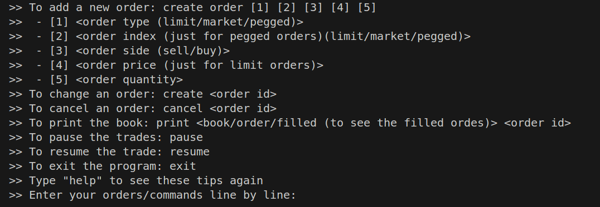

# Matching Engine

# Bugs corrigidos & melhorias:
1. Agora, Todas as ordens criadas enquanto o comércio estava pausado, serão executadas de acordo com sua prioridade. Antes, apenas a última ordem criada era executada quando o comércio era retomado.
2. Documentação mais detalhada.
3. Separação dos classes em diferentes arquivos (ainda precisa de alguns ajustes)

# Considerações:

Escolhi desenvolver a solução em Python, pois é a linguagem com a qual tenho mais familiaridade. Embora não seja ideal para trabalhar com POO, foi o suficiente para deixar o código mais legível e simples. 

A interação com o programa é por meio das linhas de comando, para isso basta executar o arquivo main.py. É possível digitar “help” para ter acesso a uma explicação rápida.

# Bônus:

## 1. “Implementar uma função/método para visualização do livro”

Após executar o arquivo main.py, é possível digitar:

- “print book” para ver todos as ordens ativas, bid e offer price
- “print order <order id>” para obter mais informações sobre essa ordem em específico
- “print filled” para ver todas as orders que já foram preenchidas

## 2. “Soluções que respeitem a ordem de chegada das ordens”

Utilizei dicionários para armazenar as ordens à medida que são criadas. Assim como os vetores, em Python, os dicionários presenvam a ordem de adição. Assim, a prioridade é respeitada durante a iteração.

O uso de dicionário também junto com um id único como chave para cada nova ordem gerada, resulta em um ganho de performance, pois a leitura de qualquer ordem é feita em O(1), não sendo necessário percorrer todo o array para encontrar uma ordem em específico.

## 3. “Implementação de cancelamento”

Quando uma nova ordem é criada, seu ID, junto com as demais informações é mostrado no prompt e pode ser utilizado para cancelar essa ordem depois.

## 4. “Implementação de alteração de ordem”

O ID da ordem também é utilizado para alterá-la.

## 5. “Pegged orders”

Implementei os preços dinâmicos através de atributos de classe que são atualizados sempre que adiciono ou removo ordens do livro. Assim, quando os preços de instâncias do tipo pegged são requeridos, acesso o atributo da classe em vez do preço individual, como ocorre para os demais tipos. 

# Complexidade

A função que mais se afasta da complexidade linear é a que ordena os dicionários e é utilizada na execução de ordens do tipo market. utilizei a função [sorted()](https://en.wikipedia.org/wiki/Timsort#Analysis) e sua complexidade, na maioria dos casos, é O(nlogn), assim, ela continua polinomial, logo ainda é “eficiente”

